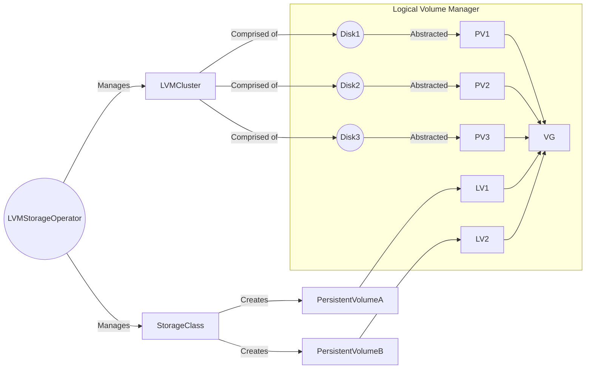

# lvm-operator

Operator that manages Topolvm

```mermaid
graph LR
LVMStorageOperator((LVMStorageOperator))-->|Manages| LVMCluster
LVMStorageOperator-->|Manages| StorageClass
StorageClass-->|Creates| PersistentVolumeA
StorageClass-->|Creates| PersistentVolumeB
PersistentVolumeA-->LV1
PersistentVolumeB-->LV2
LVMCluster-->|Comprised of|Disk1((Disk1))
LVMCluster-->|Comprised of|Disk2((Disk2))
LVMCluster-->|Comprised of|Disk3((Disk3))

subgraph Logical Volume Manager
  Disk1-->|Abstracted|PV1
  Disk2-->|Abstracted|PV2
  Disk3-->|Abstracted|PV3
  PV1-->VG
  PV2-->VG
  PV3-->VG
  LV1-->VG
  LV2-->VG
end
```

# Contents

- [docs/design](doc/design/)

Learn how to install and use this Operator with [the install documentation](doc/usage/install.md).
