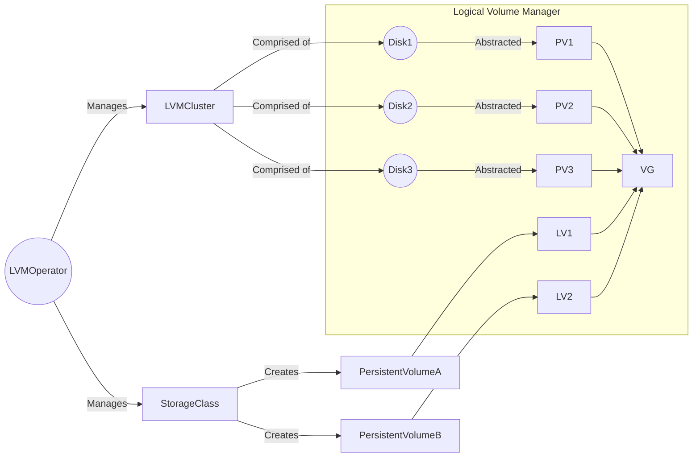

# The LVM Operator

Use the LVM Operator with `LVMCluster` custom resources to deploy and manage LVM storage on OpenShift clusters.

The LVM Operator leverages the [TopoLVM CSI Driver](https://github.com/topolvm/topolvm) on the backend to dynamically create LVM physical volumes, volume groups and logical volumes, and binds them to `PersistentVolumeClaim` resources.
This allows applications running on the cluster to consume storage from LVM logical volumes backed by the TopoLVM CSI Driver.

The LVM Operator, in conjunction with the TopoLVM CSI Driver, Volume Group Manager, and other related components, collectively comprise the Logical Volume Manager Storage (LVMS) solution.

Here is a brief overview of how the Operator works. See [here](docs/design/architecture.md) for the architecture diagram.



- [Deploying the LVM Operator](#deploying-the-lvm-operator)
    * [Using the pre-built images](#using-the-pre-built-images)
    * [Building the Operator yourself](#building-the-operator-yourself)
    * [Deploying the Operator](#deploying-the-operator)
    * [Inspecting the storage objects on the node](#inspecting-the-storage-objects-on-the-node)
    * [Testing the Operator](#testing-the-operator)
- [Cleanup](#cleanup)
- [Metrics](#metrics)
- [Known Limitations](#known-limitations)
    * [Single LVMCluster support](#single-lvmcluster-support)
    * [Upgrades from v 4.10 and v4.11](#upgrades-from-v-410-and-v411)
- [Troubleshooting](#troubleshooting)
- [Contributing](#contributing)

## Deploying the LVM Operator

Due to the absence of a CI pipeline that builds this repository, you will need to either build it yourself or use a pre-built image that has been made available. Please note that the pre-built image may not be in sync with the current state of the repository.

### Using the pre-built images

If you are comfortable using the pre-built images, simply proceed with the [deployment steps](#deploying-the-operator).

### Building the Operator yourself

To build the Operator, install Docker or Podman and log into your registry.

1. Set the following environment variables to the repository where you want to host your image:

    ```bash
    $ export IMAGE_REGISTRY=<quay/docker etc>
    $ export REGISTRY_NAMESPACE=<registry-username>
    $ export IMAGE_TAG=<some-tag>
    ```

2. Build and push the container image:

    ```bash
    $ make docker-build docker-push
    ```

<details><summary><strong>Building the Operator for OLM deployment</strong></summary>
<p>

If you intend to deploy the Operator using the Operator Lifecycle Manager (OLM), there are some additional steps you should follow.

1. Build and push the bundle image:

    ```bash
    $ make bundle-build bundle-push
    ```

2. Build and push the catalog image:

    ```bash
    $ make catalog-build catalog-push
    ```

</p>
</details>

Ensure that the OpenShift cluster has read access to that repository. Once this is complete, you are ready to proceed with the next steps.

### Deploying the Operator

You can begin the deployment by running the following command:

```bash
$ make deploy
```

<details><summary><strong>Deploying the Operator with OLM</strong></summary>
<p>

You can begin the deployment using the Operator Lifecycle Manager (OLM) by running the following command:

```bash
$ make deploy-with-olm
```

The process involves the creation of several resources to deploy the Operator using OLM. These include a custom `CatalogSource` to define the Operator source, the `openshift-storage` namespace to contain the Operator components, an `OperatorGroup` to manage the lifecycle of the Operator, a `Subscription` to subscribe to the Operator catalog in the `openshift-storage` namespace, and finally, the creation of a `ClusterServiceVersion` to describe the Operator's capabilities and requirements.

Wait until the `ClusterServiceVersion` (CSV) reaches the `Succeeded` status:

```bash
$ kubectl get csv -n openshift-storage

NAME                   DISPLAY       VERSION   REPLACES   PHASE
lvms-operator.v0.0.1   LVM Storage   0.0.1                Succeeded
```

</p>
</details>

After the previous command has completed successfully, switch over to the `openshift-storage` namespace:

```bash
$ oc project openshift-storage
```

Wait until all pods have started running:

```bash
$ oc get pods -w
```

Once all pods are running, create a sample `LVMCluster` custom resource (CR):

```bash
$ oc create -n openshift-storage -f https://github.com/openshift/lvm-operator/raw/main/config/samples/lvm_v1alpha1_lvmcluster.yaml
```

After the CR is deployed, the following actions are executed:

- A Logical Volume Manager (LVM) volume group named `vg1` is created, utilizing all available disks on the cluster.
- A thin pool named `thin-pool-1` is created within `vg1`, with a size equivalent to 90% of `vg1`.
- The TopoLVM Container Storage Interface (CSI) plugin is deployed, resulting in the launch of the `topolvm-controller` and `topolvm-node` pods.
- A storage class and a volume snapshot class are created, both named `lvms-vg1`. This facilitates storage provisioning for OpenShift workloads. The storage class is configured with the `WaitForFirstConsumer` volume binding mode that is utilized in a multi-node configuration to optimize the scheduling of pod placement. This strategy prioritizes the allocation of pods to nodes with the greatest amount of available storage capacity.
- The LVMS system also creates two additional internal CRs to support its functionality:
  * `LVMVolumeGroup` is generated and managed by LVMS to monitor the individual volume groups across multiple nodes in the cluster.
  * `LVMVolumeGroupNodeStatus` is created by the [Volume Group Manager](docs/design/vg-manager.md). This CR is used to monitor the status of volume groups on individual nodes in the cluster.

Wait until the `LVMCluster` reaches the `Ready` status:

```bash
$ oc get lvmclusters.lvm.topolvm.io my-lvmcluster

NAME            STATUS
my-lvmcluster   Ready
```

Wait until all pods are active:

```bash
$ oc get pods -w
```

The `topolvm-node` pod remains in the initialization phase until the `vg-manager` completes all the necessary preparations.

Once all the pods have been launched, the LVMS is ready to manage your logical volumes and make them available for use in your applications.

### Inspecting the storage objects on the node

Prior to the deployment of the Logical Volume Manager Storage (LVMS), there are no pre-existing LVM physical volumes, volume groups, or logical volumes associated with the disks.

```bash
sh-4.4# lsblk
NAME    MAJ:MIN RM   SIZE RO TYPE MOUNTPOINT
sdb       8:16   0 893.8G  0 disk
|-sdb1    8:17   0     1M  0 part
|-sdb2    8:18   0   127M  0 part
|-sdb3    8:19   0   384M  0 part /boot
`-sdb4    8:20   0 893.3G  0 part /sysroot
sr0      11:0    1   987M  0 rom
nvme0n1 259:0    0   1.5T  0 disk
nvme1n1 259:1    0   1.5T  0 disk
nvme2n1 259:2    0   1.5T  0 disk
sh-4.4# pvs
sh-4.4# vgs
sh-4.4# lvs
```

After successful deployment, the necessary LVM physical volumes, volume groups, and thin pools are created on the host.

```bash
sh-4.4# pvs
  PV           VG  Fmt  Attr PSize  PFree 
  /dev/nvme0n1 vg1 lvm2 a--  <1.46t <1.46t
  /dev/nvme1n1 vg1 lvm2 a--  <1.46t <1.46t
  /dev/nvme2n1 vg1 lvm2 a--  <1.46t <1.46t
sh-4.4# vgs
  VG  #PV #LV #SN Attr   VSize  VFree 
  vg1   3   0   0 wz--n- <4.37t <4.37t
sh-4.4# lvs
  LV          VG  Attr       LSize  Pool Origin Data%  Meta%  Move Log Cpy%Sync Convert
  thin-pool-1 vg1 twi-a-tz-- <3.93t             0.00   1.19      
```

### Testing the Operator

Once you have completed [the deployment steps](#deploying-the-operator), you can proceed to create a basic test application that will consume storage.

To initiate the process, create a Persistent Volume Claim (PVC):

```bash
$ cat <<EOF | oc apply -f -
apiVersion: v1
kind: PersistentVolumeClaim
metadata:
  name: lvms-test
  labels:
    type: local
spec:
  storageClassName: lvms-vg1
  resources:
    requests:
      storage: 5Gi
  accessModes:
    - ReadWriteOnce
  volumeMode: Filesystem
EOF
```

Upon creation, you may observe that the PVC remains in a `Pending` state.

```bash
$ oc get pvc

NAME        STATUS    VOLUME   CAPACITY   ACCESS MODES   STORAGECLASS   AGE
lvms-test   Pending                                      lvms-vg1       7s
```

This behavior is expected as the storage class awaits the creation of a pod that requires the PVC.

To move forward, create a pod that can utilize this PVC:

```bash
$ cat <<EOF | oc apply -f -
apiVersion: v1
kind: Pod
metadata:
  name: lvms-test
spec:
  volumes:
    - name: storage
      persistentVolumeClaim:
        claimName: lvms-test
  containers:
    - name: container
      image: public.ecr.aws/docker/library/nginx:latest
      ports:
        - containerPort: 80
          name: "http-server"
      volumeMounts:
        - mountPath: "/usr/share/nginx/html"
          name: storage
EOF
```

Once the pod has been created and associated with the corresponding PVC, the PVC is bound, and the pod transitions to the `Running` state.

```bash
$ oc get pvc,pods

NAME                              STATUS   VOLUME                                     CAPACITY   ACCESS MODES   STORAGECLASS   AGE
persistentvolumeclaim/lvms-test   Bound    pvc-a37ef71c-a9b9-45d8-96e8-3b5ad30a84f6   5Gi        RWO            lvms-vg1       3m2s

NAME            READY   STATUS    RESTARTS   AGE
pod/lvms-test   1/1     Running   0          28s
```

## Cleanup

To perform a full cleanup, follow these steps:

1. Remove all the application pods which are using PVCs created with LVMS, and then remove all these PVCs.

2. Ensure that there are no remaining `LogicalVolume` custom resources that were created by LVMS.

    ```bash
    $ oc get logicalvolumes.topolvm.io 
    No resources found
    ```

3. Remove the `LVMCluster` CR.
    
    ```bash
    $ oc delete lvmclusters.lvm.topolvm.io my-lvmcluster
    lvmcluster.lvm.topolvm.io "my-lvmcluster" deleted
    ```
   
    If the previous command is stuck, it may be necessary to perform a [forced cleanup procedure](./docs/troubleshooting.md#forced-cleanup).

4. Verify that the only remaining resource in the `openshift-storage` namespace is the Operator.

    ```bash
    oc get pods -n openshift-storage
    NAME                                 READY   STATUS    RESTARTS   AGE
    lvms-operator-8bf864c85-8zjlp        3/3     Running   0          125m
    ```

5. To begin the undeployment process of LVMS, use the following command:

    ```bash
    make undeploy
    ```

## E2E Tests

There are a few steps required to run the end-to-end tests for LVMS. 

You will need the following evironment variables set:
```bash
IMAGE_REGISTRY={{REGISTRY_URL}} # Ex: quay.io
REGISTRY_NAMESPACE={{REGISTRY_NAMESPACE}} # Ex: lvms-dev, this should be your own personal namespace
```

Once the environment variables are set, you can run
```bash
# build and deploy your local code to the cluster
$ make deploy-local

# Wait for the lvms-operator to have status=Running
$ oc -n openshift-storage get pods
# NAME                             READY   STATUS    RESTARTS   AGE
# lvms-operator-579fbf46d5-vjwhp   3/3     Running   0          3m27s

# run the e2e tests
$ make e2e 

# undeploy the operator from the cluster
$ make undeploy
```

## Metrics

The LVM Operator runs a metrics exporter sidecar to export Prometheus metrics. To enable monitoring on OpenShift clusters, assign the `openshift.io/cluster-monitoring` label to the same namespace that you deployed LVMS to.

```bash
$ oc patch namespace/openshift-storage -p '{"metadata": {"labels": {"openshift.io/cluster-monitoring": "true"}}}'
```

Currently, LVMS provides only TopoLVM metrics, which can be accessed either via OpenShift Console or by port-forwarding the relevant service.

```bash
# port-forward service in one terminal
$ oc port-forward svc/topolvm-node-metrics 50000:8080
Forwarding from 127.0.0.1:41685 -> 8080
Forwarding from [::1]:41685 -> 8080
...
...

# in another terminal, view the metrics in localhost using the specified port above 
$ curl -s localhost:50000/metrics | grep -Ei 'topolvm_volumegroup_.*?_bytes\{'
topolvm_volumegroup_available_bytes{device_class="vg1",node="kube-node"} 4.790222323712e+12
topolvm_volumegroup_size_bytes{device_class="vg1",node="kube-node"} 4.800959741952e+12
```

## Known Limitations

### Single LVMCluster support

LVMS does not support the reconciliation of multiple LVMCluster custom resources simultaneously.

### Upgrades from v 4.10 and v4.11

It is not possible to upgrade from release-4.10 and release-4.11 to a newer version due to a breaking change that has been implemented. For further information on this matter, consult [the relevant documentation](https://github.com/topolvm/topolvm/blob/main/docs/proposals/rename-group.md).

## Troubleshooting

See the [troubleshooting guide](docs/troubleshooting.md).

## Contributing

See the [contribution guide](CONTRIBUTING.md).
