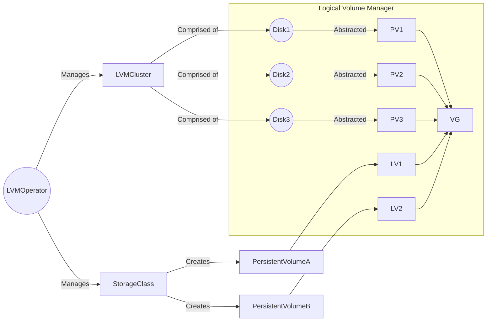

# The LVM Operator - part of LVMS

## [Official LVMS Product Documentation](https://docs.openshift.com/container-platform/latest/storage/persistent_storage/persistent_storage_local/persistent-storage-using-lvms.html)

For the latest information about usage and installation of LVMS (Logical Volume Manager Storage) in OpenShift, please use the official product documentation linked above.

## Overview

Use the LVM Operator with `LVMCluster` custom resources to deploy and manage LVM storage on OpenShift clusters.

The LVM Operator leverages the [TopoLVM CSI Driver](https://github.com/topolvm/topolvm) on the backend to dynamically create LVM physical volumes, volume groups and logical volumes, and binds them to `PersistentVolumeClaim` resources.
This allows applications running on the cluster to consume storage from LVM logical volumes backed by the TopoLVM CSI Driver.

The LVM Operator, in conjunction with the TopoLVM CSI Driver, Volume Group Manager, and other related components, collectively comprise the Logical Volume Manager Storage (LVMS) solution.

Here is a brief overview of how the Operator works. See [here](docs/design/architecture.md) for the architecture diagram.



- [Deploying the LVM Operator](#deploying-the-lvm-operator)
    * [Using the pre-built images](#using-the-pre-built-images)
    * [Building the Operator yourself](#building-the-operator-yourself)
    * [Deploying the Operator](#deploying-the-operator)
    * [Inspecting the storage objects on the node](#inspecting-the-storage-objects-on-the-node)
    * [Testing the Operator](#testing-the-operator)
- [Cleanup](#cleanup)
- [Metrics](#metrics)
- [Known Limitations](#known-limitations)
    * [Unsupported Device Types](#unsupported-device-types)
    * [Single LVMCluster support](#single-lvmcluster-support)
    * [Upgrades from v 4.10 and v4.11](#upgrades-from-v-410-and-v411)
    * [Missing native LVM RAID Configuration support](#missing-native-lvm-raid-configuration-support)
    * [Missing LV-level encryption support](#missing-lv-level-encryption-support)
    * [Snapshotting and Cloning in Multi-Node Topologies](#snapshotting-and-cloning-in-multi-node-topologies)
    * [Validation of `LVMCluster` CRs outside the `openshift-storage` namespace](#validation-of-lvmcluster-crs-outside-the-openshift-storage-namespace)
- [Troubleshooting](#troubleshooting)
- [Contributing](#contributing)

## Deploying the LVM Operator

Due to the absence of a CI pipeline that builds this repository, you will need to either build it yourself or use a pre-built image that has been made available. Please note that the pre-built image may not be in sync with the current state of the repository.

### Using the pre-built images

If you are comfortable using the pre-built images, simply proceed with the [deployment steps](#deploying-the-operator).

### Building the Operator yourself

To build the Operator, install Docker or Podman and log into your registry.

1. Set the following environment variables to the repository where you want to host your image:

    ```bash
    $ export IMAGE_REGISTRY=<quay/docker etc>
    $ export REGISTRY_NAMESPACE=<registry-username>
    $ export IMAGE_TAG=<some-tag>
    ```

2. Build and push the container image:

    ```bash
    $ make docker-build docker-push
    ```

<details><summary><strong>Building the Operator for OLM deployment</strong></summary>
<p>

If you intend to deploy the Operator using the Operator Lifecycle Manager (OLM), there are some additional steps you should follow.

1. Build and push the bundle image:

    ```bash
    $ make bundle-build bundle-push
    ```

2. Build and push the catalog image:

    ```bash
    $ make catalog-build catalog-push
    ```

</p>
</details>

Ensure that the OpenShift cluster has read access to that repository. Once this is complete, you are ready to proceed with the next steps.

### Deploying the Operator

You can begin the deployment by running the following command:

```bash
$ make deploy
```

<details><summary><strong>Deploying the Operator with OLM</strong></summary>
<p>

You can begin the deployment using the Operator Lifecycle Manager (OLM) by running the following command:

```bash
$ make deploy-with-olm
```

The process involves the creation of several resources to deploy the Operator using OLM. These include a custom `CatalogSource` to define the Operator source, the `openshift-storage` namespace to contain the Operator components, an `OperatorGroup` to manage the lifecycle of the Operator, a `Subscription` to subscribe to the Operator catalog in the `openshift-storage` namespace, and finally, the creation of a `ClusterServiceVersion` to describe the Operator's capabilities and requirements.

Wait until the `ClusterServiceVersion` (CSV) reaches the `Succeeded` status:

```bash
$ kubectl get csv -n openshift-storage

NAME                   DISPLAY       VERSION   REPLACES   PHASE
lvms-operator.v0.0.1   LVM Storage   0.0.1                Succeeded
```

</p>
</details>

After the previous command has completed successfully, switch over to the `openshift-storage` namespace:

```bash
$ oc project openshift-storage
```

Wait until all pods have started running:

```bash
$ oc get pods -w
```

Once all pods are running, create a sample `LVMCluster` custom resource (CR):

```bash
$ oc create -n openshift-storage -f https://github.com/openshift/lvm-operator/raw/main/config/samples/lvm_v1alpha1_lvmcluster.yaml
```

After the CR is deployed, the following actions are executed:

- A Logical Volume Manager (LVM) volume group named `vg1` is created, utilizing all available disks on the cluster.
- A thin pool named `thin-pool-1` is created within `vg1`, with a size equivalent to 90% of `vg1`.
- The TopoLVM Container Storage Interface (CSI) plugin is deployed, resulting in the launch of the `topolvm-controller` and `topolvm-node` pods.
- A storage class and a volume snapshot class are created, both named `lvms-vg1`. This facilitates storage provisioning for OpenShift workloads. The storage class is configured with the `WaitForFirstConsumer` volume binding mode that is utilized in a multi-node configuration to optimize the scheduling of pod placement. This strategy prioritizes the allocation of pods to nodes with the greatest amount of available storage capacity.
- The LVMS system also creates two additional internal CRs to support its functionality:
  * `LVMVolumeGroup` is generated and managed by LVMS to monitor the individual volume groups across multiple nodes in the cluster.
  * `LVMVolumeGroupNodeStatus` is created by the [Volume Group Manager](docs/design/vg-manager.md). This CR is used to monitor the status of volume groups on individual nodes in the cluster.

Wait until the `LVMCluster` reaches the `Ready` status:

```bash
$ oc get lvmclusters.lvm.topolvm.io my-lvmcluster

NAME            STATUS
my-lvmcluster   Ready
```

Wait until all pods are active:

```bash
$ oc get pods -w
```

The `topolvm-node` pod remains in the initialization phase until the `vg-manager` completes all the necessary preparations.

Once all the pods have been launched, the LVMS is ready to manage your logical volumes and make them available for use in your applications.

### Inspecting the storage objects on the node

Prior to the deployment of the Logical Volume Manager Storage (LVMS), there are no pre-existing LVM physical volumes, volume groups, or logical volumes associated with the disks.

```bash
sh-4.4# lsblk
NAME    MAJ:MIN RM   SIZE RO TYPE MOUNTPOINT
sdb       8:16   0 893.8G  0 disk
|-sdb1    8:17   0     1M  0 part
|-sdb2    8:18   0   127M  0 part
|-sdb3    8:19   0   384M  0 part /boot
`-sdb4    8:20   0 893.3G  0 part /sysroot
sr0      11:0    1   987M  0 rom
nvme0n1 259:0    0   1.5T  0 disk
nvme1n1 259:1    0   1.5T  0 disk
nvme2n1 259:2    0   1.5T  0 disk
sh-4.4# pvs
sh-4.4# vgs
sh-4.4# lvs
```

After successful deployment, the necessary LVM physical volumes, volume groups, and thin pools are created on the host.

```bash
sh-4.4# pvs
  PV           VG  Fmt  Attr PSize  PFree
  /dev/nvme0n1 vg1 lvm2 a--  <1.46t <1.46t
  /dev/nvme1n1 vg1 lvm2 a--  <1.46t <1.46t
  /dev/nvme2n1 vg1 lvm2 a--  <1.46t <1.46t
sh-4.4# vgs
  VG  #PV #LV #SN Attr   VSize  VFree
  vg1   3   0   0 wz--n- <4.37t <4.37t
sh-4.4# lvs
  LV          VG  Attr       LSize  Pool Origin Data%  Meta%  Move Log Cpy%Sync Convert
  thin-pool-1 vg1 twi-a-tz-- <3.93t             0.00   1.19
```

### Testing the Operator

Once you have completed [the deployment steps](#deploying-the-operator), you can proceed to create a basic test application that will consume storage.

To initiate the process, create a Persistent Volume Claim (PVC):

```bash
$ cat <<EOF | oc apply -f -
apiVersion: v1
kind: PersistentVolumeClaim
metadata:
  name: lvms-test
  labels:
    type: local
spec:
  storageClassName: lvms-vg1
  resources:
    requests:
      storage: 5Gi
  accessModes:
    - ReadWriteOnce
  volumeMode: Filesystem
EOF
```

Upon creation, you may observe that the PVC remains in a `Pending` state.

```bash
$ oc get pvc

NAME        STATUS    VOLUME   CAPACITY   ACCESS MODES   STORAGECLASS   AGE
lvms-test   Pending                                      lvms-vg1       7s
```

This behavior is expected as the storage class awaits the creation of a pod that requires the PVC.

To move forward, create a pod that can utilize this PVC:

```bash
$ cat <<EOF | oc apply -f -
apiVersion: v1
kind: Pod
metadata:
  name: lvms-test
spec:
  volumes:
    - name: storage
      persistentVolumeClaim:
        claimName: lvms-test
  containers:
    - name: container
      image: public.ecr.aws/docker/library/nginx:latest
      ports:
        - containerPort: 80
          name: "http-server"
      volumeMounts:
        - mountPath: "/usr/share/nginx/html"
          name: storage
EOF
```

Once the pod has been created and associated with the corresponding PVC, the PVC is bound, and the pod transitions to the `Running` state.

```bash
$ oc get pvc,pods

NAME                              STATUS   VOLUME                                     CAPACITY   ACCESS MODES   STORAGECLASS   AGE
persistentvolumeclaim/lvms-test   Bound    pvc-a37ef71c-a9b9-45d8-96e8-3b5ad30a84f6   5Gi        RWO            lvms-vg1       3m2s

NAME            READY   STATUS    RESTARTS   AGE
pod/lvms-test   1/1     Running   0          28s
```

## Cleanup

To perform a full cleanup, follow these steps:

1. Remove all the application pods which are using PVCs created with LVMS, and then remove all these PVCs.

2. Ensure that there are no remaining `LogicalVolume` custom resources that were created by LVMS.

    ```bash
    $ oc get logicalvolumes.topolvm.io
    No resources found
    ```

3. Remove the `LVMCluster` CR.

    ```bash
    $ oc delete lvmclusters.lvm.topolvm.io my-lvmcluster
    lvmcluster.lvm.topolvm.io "my-lvmcluster" deleted
    ```

    If the previous command is stuck, it may be necessary to perform a [forced cleanup procedure](./docs/troubleshooting.md#forced-cleanup).

4. Verify that the only remaining resource in the `openshift-storage` namespace is the Operator.

    ```bash
    oc get pods -n openshift-storage
    NAME                                 READY   STATUS    RESTARTS   AGE
    lvms-operator-8bf864c85-8zjlp        3/3     Running   0          125m
    ```

5. To begin the undeployment process of LVMS, use the following command:

    ```bash
    make undeploy
    ```

## E2E Tests

There are a few steps required to run the end-to-end tests for LVMS.

You will need the following environment variables set:
```bash
IMAGE_REGISTRY={{REGISTRY_URL}} # Ex: quay.io
REGISTRY_NAMESPACE={{REGISTRY_NAMESPACE}} # Ex: lvms-dev, this should be your own personal namespace
```

Once the environment variables are set, you can run
```bash
# build and deploy your local code to the cluster
$ make deploy-local

# Wait for the lvms-operator to have status=Running
$ oc -n openshift-storage get pods
# NAME                             READY   STATUS    RESTARTS   AGE
# lvms-operator-579fbf46d5-vjwhp   3/3     Running   0          3m27s

# run the e2e tests
$ make e2e

# undeploy the operator from the cluster
$ make undeploy
```

## Metrics

To enable monitoring on OpenShift clusters, assign the `openshift.io/cluster-monitoring` label to the same namespace that you deployed LVMS to.

```bash
$ oc patch namespace/openshift-storage -p '{"metadata": {"labels": {"openshift.io/cluster-monitoring": "true"}}}'
```

LVMS provides [TopoLVM metrics](https://github.com/topolvm/topolvm/blob/v0.21.0/docs/topolvm-node.md#prometheus-metrics) and `controller-runtime` metrics, which can be accessed via OpenShift Console.

## Known Limitations

### Unsupported Device Types

Here is a list of the types of devices that are excluded by LVMS. To get more information about the devices on your machine and to check if they fall under any of these filters, run:

```bash
$ lsblk --paths --json -o NAME,ROTA,TYPE,SIZE,MODEL,VENDOR,RO,STATE,KNAME,SERIAL,PARTLABEL,FSTYPE
```

1. **Read-Only Devices:**
    - *Condition:* Devices marked as `read-only` are unsupported.
    - *Why:* LVMS requires the ability to write and modify data dynamically, which is not possible with devices set to read-only mode.
    - *Filter:* `ro` is set to `true`.

2. **Suspended Devices:**
    - *Condition:* Devices in a `suspended` state are unsupported.
    - *Why:* A suspended state implies that a device is temporarily inactive or halted, and attempting to incorporate such devices into LVMS can introduce complexities and potential issues.
    - *Filter:* `state` is `suspended`.

3. **Devices with Invalid Partition Labels:**
    - *Condition:* Devices with partition labels such as `bios`, `boot`, or `reserved` are unsupported.
    - *Why:* These labels indicate reserved or specialized functionality associated with specific system components. Attempting to use such devices within LVMS may lead to unintended consequences, as these labels may be reserved for system-related activities.
    - *Filter:* `partlabel` has either `bios`, `boot`, or `reserved`.

4. **Devices with Invalid Filesystem Signatures:**
    - *Condition:* Devices with invalid filesystem signatures are unsupported. This includes:
        - Devices with a filesystem type set to `LVM2_member` (only valid if no children).
        - Devices with no free capacity as a physical volume.
        - Devices already part of another volume group.
    - *Why:* These conditions indicate that either this device is already used by another volume group or have no free capacity to be used within LVMS.
    - *Filter:* `fstype` is not `null`, or `fstype` is set to `LVM2_member` and has children block devices, or `pvs --units g -v --reportformat json` returns `pv_free` for the block device set to `0G`.

5. **Devices with Children:**
    - *Condition:* Devices with children block devices are unsupported.
    - *Why:* LVMS operates optimally with standalone block devices that are not part of a hierarchical structure. Devices with children can complicate volume management, potentially causing conflicts, errors, or difficulties in tracking and managing logical volumes.
    - *Filter:* `children` has children block devices.

6. **Devices with Bind Mounts:**
    - *Condition:* Devices with bind mounts are unsupported.
    - *Why:* Managing logical volumes becomes more complex when dealing with devices that have bind mounts, potentially causing conflicts or difficulties in maintaining the integrity of the logical volume setup.
    - *Filter:* `cat /proc/1/mountinfo | grep <device-name>` returns mount points for the device in the 4th or 10th field.

7. **ROM Devices:**
    - *Condition:* Devices of type `rom` are unsupported.
    - *Why:* Such devices are designed for static data storage and lack the necessary read-write capabilities essential for dynamic operations performed by LVMS.
    - *Filter:* `type` is set to `rom`.

8. **LVM Partitions:**
    - *Condition:* Devices of type `LVM` partition are unsupported.
    - *Why:* These partitions are already dedicated to LVM and are managed as part of an existing volume group.
    - *Filter:* `type` is set to `lvm`.

9. **Loop Devices:**
    - *Condition:* Loop Devices must not be used if they are already in use by Kubernetes.
    - *Why:* When loop devices are utilized by Kubernetes, they are likely configured for specific tasks or processes managed by the Kubernetes environment. Integrating loop devices that are already in use by Kubernetes into LVMS can lead to potential conflicts and interference with the Kubernetes system.
    - *Filter:* `type` is set to `loop`, and `losetup <loop-device> -O BACK-FILE --json` returns a `back-file` which contains `plugins/kubernetes.io`.

Devices meeting any of these conditions are filtered out for LVMS operations.

_NOTE: It is strongly recommended to perform a thorough wipe of a device before using it within LVMS to proactively prevent unintended behaviors or potential issues._

### Single LVMCluster support

LVMS does not support the reconciliation of multiple LVMCluster custom resources simultaneously.

### Upgrades from v 4.10 and v4.11

It is not possible to upgrade from release-4.10 and release-4.11 to a newer version due to a breaking change that has been implemented. For further information on this matter, consult [the relevant documentation](https://github.com/topolvm/topolvm/blob/main/docs/proposals/rename-group.md).

### Missing native LVM RAID Configuration support

Currently, LVM Operator forces all LVMClusters to work with a thinly provisioned volume in order to support Snapshotting and Cloning on PVCs.
This is backed by an LVM Logical Volume of type `thin`, which is reflected in the LVM flags as an attribute.
When trying to use LVM's inbuilt RAID capabilities, it conflicts with this `thin` attribute as the same flag is also indicative whether a volume is part of LVM RAID configurations (`r` or `R` flag).
This means that the only way to support RAID configuration from within `LVM` would be to do a conversion from two RAID Arrays into a thinpool with `lvconvert`, after which the RAID is no longer recognized by LVM (due to said conflict in the volume attributes).
While this would enable initial synchronization and redundancy, all repair and extend operations would not longer respect the RAID topology in the Volume Group, and operations like `lvconvert --repair` are not even supported anymore.
This means that it would be quite a complex situation to recover from.

Instead of doing LVM based RAIDs, we recommend using the [`mdraid`](https://access.redhat.com/documentation/en-us/red_hat_enterprise_linux/9/html/managing_storage_devices/managing-raid_managing-storage-devices#linux-raid-subsystems_managing-raid) subsystem in linux instead of the LVM RAID capabilities.
Simply create a RAID array with `mdadm` and then use this in your `deviceSelector` within `LVMCluster`:

1. For a simple RAID1, you could use `mdadm --create /dev/md0 --level=1 --raid-devices=2 /dev/sda1 /dev/sdc1`
2. Then you can reference `/dev/md0` in the `deviceSelector` as normal
3. Any recovery and syncing will then happen with `mdraid`: [Replacing Disks](https://access.redhat.com/documentation/en-us/red_hat_enterprise_linux/9/html/managing_storage_devices/managing-raid_managing-storage-devices#replacing-a-failed-disk-in-raid_managing-raid) and [Repairing](https://access.redhat.com/documentation/en-us/red_hat_enterprise_linux/9/html/managing_storage_devices/managing-raid_managing-storage-devices#repairing-raid-disks_managing-raid) will work transparently of LVMS and can be covered by a sysadmin of the Node.

_NOTE: Currently, RAID Arrays created with `mdraid` are not automatically recognized when not using any `deviceSelector`, thus they MUST be specified explicitly._

### Missing LV-level encryption support

Currently, LVM Operator does not have a native LV-level encryption support. Instead, you can encrypt the entire disk or partitions, and use them within LVMCluster. This way all LVs created by LVMS on this disk will be encrypted out-of-the-box.

Here is an example `MachineConfig` that can be used to configure encrypted partitions during an OpenShift installation:

```yaml
apiVersion: machineconfiguration.openshift.io/v1
kind: MachineConfig
metadata:
  name: 98-encrypted-disk-partition-master
  labels:
    machineconfiguration.openshift.io/role: master
spec:
  config:
    ignition:
      version: 3.2.0
    storage:
      disks:
        - device: /dev/nvme0n1
          wipeTable: false
          partitions:
            - sizeMiB: 204800
              startMiB: 600000
              label: application
              number: 5
      luks:
        - clevis:
            tpm2: true
          device: /dev/disk/by-partlabel/application
          name: application
          options:
          - --cipher
          - aes-cbc-essiv:sha256
          wipeVolume: true
```

Then, the path to the encrypted partition `/dev/mapper/application` can be specified in the `deviceSelector`.

For non-OpenShift clusters, you can encrypt a disk using LUKS with `cryptsetup`, and then use this in your `deviceSelector` within `LVMCluster`:

1. Set up the `/dev/sdb` device for encryption. This will also remove all the data on the device:

   ```bash
   cryptsetup -y -v luksFormat /dev/sdb
   ```

    You'll be prompted to set a passphrase to unlock the volume.

2. Create a logical device-mapper device named `encrypted`, mounted to the LUKS-encrypted device:

   ```bash
   cryptsetup luksOpen /dev/sdb encrypted
   ```

    You'll be prompted to enter the passphrase you set when creating the volume.

3. You can now reference `/dev/mapper/encrypted` in the `deviceSelector`.

### Snapshotting and Cloning in Multi-Node Topologies

In general, since LVMCluster does not ensure data replication, `VolumeSnapshots` and consumption of them is always limited to the original dataSource.
Thus, snapshots must be created on the same node as the original data. Also, all pods relying on a PVC that is using the snapshot data will have to be scheduled
on the node that contained the original `LogicalVolume` in TopoLVM.

It should be noted that snapshotting is based on Thin-Pool Snapshots from upstream TopoLVM and are still considered [experimental in upstream](https://github.com/topolvm/topolvm/discussions/737).
This is because multi-node Kubernetes clusters have the scheduler figure out pod placement logically onto different nodes (with the node topology from the native Kubernetes Scheduler responsible for deciding the node where Pods should be deployed),
and it cannot always be guaranteed that Snapshots are provisioned on the same node as the original data (which is based on the CSI topology, known by TopoLVM) if the `PersistentVolumeClaim` is not created upfront.

If you are unsure what to make of this, always make sure that the original `PerstistentVolumeClaim` that you want to have Snapshots on is already created and `Bound`.
With these prerequisites it can be guaranteed that all follow-up `VolumeSnapshot` Objects as well as `PersistentVolumeClaim` objects depending on the original one are scheduled correctly.
The easiest way to achieve this is to use precreated `PersistentVolumeClaims` and non-ephemeral `StatefulSet` for your workload.

_NOTE: All of the above also applies for cloning the `PersistentVolumeClaims` directly by using the original `PersistentVolumeClaims` as data source instead of using a Snapshot._

### Validation of `LVMCluster` CRs outside the `openshift-storage` namespace

When creating an `LVMCluster` CR outside the `openshift-storage` namespace by installing it via `ClusterServiceVersion`, the Operator will not be able to validate the CR.
This is because the `ValidatingWebhookConfiguration` is restricted to the `openshift-storage` namespace and does not have access to the `LVMCluster` CRs in other namespaces.
Thus, the Operator will not be able to prevent the creation of invalid `LVMCluster` CRs outside the `openshift-storage` namespace.
However, it will also not pick it up and simply ignore it.

This is because Operator Lifecycle Manager (OLM) does not allow the creation of `ClusterServiceVersion` with installMode `OwnNamespace` while also not restricting the webhook configuration.
Validation in the `openshift-storage` namespace is processed normally.

## Troubleshooting

See the [troubleshooting guide](docs/troubleshooting.md).

## Contributing

See the [contribution guide](CONTRIBUTING.md).
