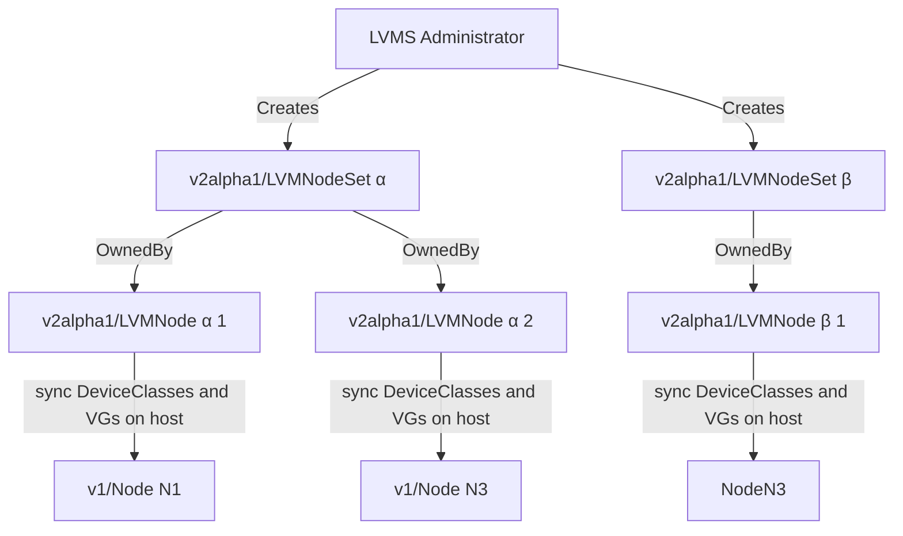

# Logical Volume Manager Storage API v2

## Summary

This document is an Enhancement Proposal for implementing a new major API version for the Logical Volume Manager Storage.
The objective of the proposal is to eliminate the assumptions made for single-node development, enabling greater configurability and ease of debugging.
It introduces changes such as the use of a Set and template which are similar to DaemonSet and Deployment respectively from Kubernetes.
The status aggregation and API interaction have been extensively rewritten.
Volume groups now can be reused by different device classes.
A transition from v1alpha1 to v2alpha1 will be provided with detailed guides, and v1alpha1 will be actively maintained until the new API is considered stable.
Risks involved include possible side effects from the adaptation and potential bugs from the major rewrite, but the authors propose that these can be mitigated through thorough documentation and extended active support of the old API version.

## Motivation

This enhancement proposal presents a comprehensive plan to develop the subsequent version of this API, with the goal of eliminating the limitations originated from assumptions made for single-node development.
Our aim is to converge our practices towards true best-practice API conventions adhering to upstream standards.
The proposed changes are designed to facilitate future development by permitting additional non-breaking changes.
This, in turn, should expedite the iteration process for developers aiming to report extra status updates.
Furthermore, we aim to simplify the process of debugging and collecting issues when encountering problems with LVMS, which currently lacks a streamlined reporting system. Hence, this proposal ultimately seeks to mitigate such issues and improve the overall user experience.

## Decision

After an unanimous decision by the LVMS team on October 17, 2023, the proposal was reviewed and postponed.
Mainly, the proposal was rejected due to the fact that the proposal was considered to be too complex to GA and implement reliably.
Notably, the v2 API is considered worthy to have but since LVMS is trying to stabilize the v1 API, the v2 API is considered to be too much of a risk to implement.
Main Factors also include that the value-add would be mostly of technical nature and not give direct customer value beyond being more in line with other Kubernetes API extensions.

Decision Takers:
- @suleymanakbas91
- @jeff-roche
- @DanielFroehlich
- @jakobmoellerdev

### Follow-Up

The decision will be followed-up with a reevaluation of the proposal after stabilizing the current v1 API within the next year (EOY 2024).

### User Stories

* As an OpenShift engineer, I want to be able to quickly debug issues with the Logical Volume Manager Storage (LVMS) without having to analyze separate resources for the desired and actual state. This means that the system should clearly display the difference between the expected and current system states, which would allow me to identify and resolve any discrepancies more efficiently.
* As an OpenShift engineer, I aim to comply with established Kubernetes API Specifications. Adhering to these conventions will simplify the process of onboarding other developers, as they're likely familiar with them, and aligns our company's practices with the wider developer community. This also means I can rely on the well-maintained upstream conventions, avoiding the need to reinvent the wheel.
* As an OpenShift engineer, I want the flexibility to design non-breaking API changes, allowing a faster iteration period on smaller API changes. This would enable iterative development and a more agile workflow, letting me incrementally build and improve our systems without causing system-wide disruptions.
* As a user of the LVMS API, I want all pertinent data for Volume Groups and Nodes readily available in one location. Having a centralized place for all related information will improve usability and make the process of managing storage configurations more straightforward and efficient.
* As a LVMS API user, I want to utilize my preexisting knowledge of Kubernetes APIs to understand the LVMS APIs more quickly. Leveraging knowledge I already have will reduce the learning curve and allow me to work more effectively and efficiently.
* As an OpenShift cluster administrator, I need to limit the minimum permissions of LVMS to namespace-level as much as possible. By doing so, I can mitigate the risk of privilege escalation into other namespaces, enhancing the overall security of the system. This would help me maintain the integrity and confidentiality of data across different namespaces, providing peace of mind and aiding in regulatory compliance.
* As an OpenShift cluster administrator, I wish to have the flexibility to deploy multiple configurations of the Logical Volume Manager Storage (LVMS) tailored to different use cases.
  This implies that the system should provide the capability to setup and manage distinct LVMS configurations concurrently. Such a feature would be beneficial in scenarios where different applications or services have diverse storage needs or performance requirements.

### Goals

* Change LVMS APIs to be compliant to the [official Kubernetes API Conventions](https://github.com/kubernetes/community/blob/master/contributors/devel/sig-architecture/api-conventions.md)
* Change LVMS APIs to be compliant to [KEP-1623: Standardize Conditions](https://github.com/kubernetes/enhancements/blob/master/keps/sig-api-machinery/1623-standardize-conditions/README.md)
* Change LVMS APIs to be compliant with [Cluster/Namespaced Operator-Scope definitions](https://sdk.operatorframework.io/docs/building-operators/golang/operator-scope/#overview)
* Introduce new interfaces for developers to more accurately report statuses to LVMS API users

### Non-Goals

* Determine when and how `v1alpha1` gets deprecated or removed. We will have to supply enough information to allow transitioning to `v2alpha1` but should not immediately get rid of `v1alpha1`.

## Proposal

We want to create a breaking change of all APIs involved in LVMS: The LVMCluster, LVMVolumeGroup and LVMVolumeGroupNodeStatus.
Specifically we want to get rid of the Topology Issues that come from LVMVolumeGroup being responsible for multiple nodes and LVMVolumeGroupNodeStatus being responsible for multiple volume groups.

At the same time, we want to change the resource following `LVMCluster` to no longer be confined to a single resource in the cluster.
Instead, we want to replace it with a namespaced resource that can be deployed as many times as an administrator desires.

### Workflow Description
**LVMS Administrator** is a human user responsible for deploying lvms in an OpenShift cluster.



1. LVMS Administrator installs LVMS through ClusterServiceVersion
2. LVMS Administrator creates any combination of `LVMNodeSet` with NodeSelector and Template for VolumeGroups and DeviceClasses based on the cluster topology.
3. `LVMNodeProviderReconciler` verifies we have a provider (e.g. TopoLVM) for the LVMNode in the cluster and installs it if necessary
4. If the provider is ready, `LVMNode.Status.Conditions[].(type=ProviderReady)` is set to `True`
5. As soon as the provider is ready, `LVMNode` is picked up by`vgmanager`.
6. `LVMNode.spec.volumeGroups` are created and reconciled by `vgmanager`.
7. `LVMNode.status.volumeGroups` are synchronized and `LVMNode.Status.Conditions[].(type=VolumeGroupsHealthy)` is set to `True`
8. `LVMNode.spec.deviceClasses` are created (with thin-pool LV on top) and synchronized to `lvmd.conf` by `vgmanager`.
9. `StorageClass` and `SnapshotClass` get created for DeviceClass by `vgmanager`.
10. `LVMNode.status.deviceClasses` are synchronized and `LVMNode.Status.Conditions[].(type=DeviceClassesHealthy)` is set to `True`
11. `LVMNode.status.state` is set to `Ready` after all conditions succeed.
12. `LVMNodeSetReconciler` picks up the `Ready` condition and sets `LVMNodeSet.Status.Conditions[].(type=LVMNodesReady)` to `True`
13. `LVMNodeSet.status.state` is set to `Ready` after all conditions succeed.

Contrasting this to the old workflow, we have significantly easier resource tracking ability.
This is because now, `.spec` and `.status` correlate with each other for both `LVMNode` and `LVMNodeSet`. Previously,
one had to look at `LVMCluster`, `LVMVolumeGroup` and `LVMVolumeGroupNodeStatus` as well as logs to get detailed information on the `lvm` subsystem.
With this proposed change, it is easily possible to recognize the `lvm` subsystem for single nodes by looking at `LVMNode` alone.

### API Extensions

#### Summary

1. The usage of a `LVMNodeSet` akin to `DaemonSet`. This is used to align the different `Node`'s into one single configurable object.
2. The introduction of a `spec.template`, similar to a `Deployment`. This template will be used by all nodes in the `LVMNodeSet` to configure individual nodes.
3. Generic Conditions for checking if the LVMNodeSetup for all nodes is ready.
4. Separation of `deviceClasses` from `volumeGroups`. This is because VolumeGroups in theory can be reused by different deviceClasses
5. Alignment of the deviceSelector to use `deviceSelectorTerms` akin to `nodeSelectorTerms` to make configuration more straight-forward for users familiar with kubernetes APIs
6. `Thin` strategy within `deviceClasses` to allow Thick provisioning extension later on
7. `storageClass` settings within `deviceClasses` to allow custom naming and alignment of `StorageClass`
8. `snapshotClass` settings within `deviceClasses` to allow custom naming and alignment of `SnapshotClass`
9. The split-up also allows to deploy multiple `LVMNodeSet` in the future, allowing us to stop prohibiting the creation of only a single `NodeSet`

Each individual node receives the entirety of the `LVMNodeSet` configuration in it's spec. However, compared to the NodeSet,
it contains detailed information about `status` elements from `volumeGroups` and `deviceClasses`, where each lvm volume group as well
as the contents of provisioned deviceClass are checked for consistency and are reported in status. In additions to this,
the Node contains more detailed conditions that allow setting up detailed status checks

#### `LVMCluster` replaced by `LVMNodeSet`

The current LVMCluster will be broken up into node-specific configurations, wherein each configuration is created through the `LVMNodeSet`,
which contains a few key spec elements:

1. `spec.nodeSelector` to determine on which nodes to create LVM configurations
2. `spec.template.volumeGroups` to determine which volumeGroups to create and with which devices based on a `deviceSelector`
3. `spec.template.deviceClasses` to determine which [TopoLVM device classes](https://github.com/topolvm/topolvm/blob/main/docs/lvmd.md#lvmd) should be prepared and configured for lvm.
   This also configures a corresponding StorageClass and SnapshotClass for that deviceClass.

```yaml
---
apiVersion: lvm.topolvm.io/v2alpha1
kind: LVMNodeSet
metadata:
  name: my-lvmnodeset
  uid: 31167fec-f8d3-47af-883f-05aaa153da88
spec:
  nodeSelector:
    nodeSelectorTerms:
      - matchExpressions:
          - key: topology.kubernetes.io/zone
            operator: In
            values:
              - antarctica-east1
              - antarctica-west1
      - matchExpressions:
          - key: custom.topology.domain.io/storage
            operator: In
            values:
              - archive-storage
  template:
    volumeGroups:
      - name: vg1
        deviceSelector:
          deviceSelectorTerms:
            - matchExpressions:
                - key: kname
                  operator: In
                  values:
                    - "/dev/mapper/some-encrypted-device"
                    - "/dev/mapper/some-fallback-device"
            - matchExpressions:
                - key: kname
                  operator: In
                  values:
                    - "/dev/mapper/some-default-device"
      - name: othervg
        deviceSelector:
          deviceSelectorTerms:
            - matchExpressions:
                - key: kname
                  operator: Any
                - key: size
                  operator: GreaterThan
                  values:
                    - "30Gi"
      - name: specific-serials
        deviceSelector:
          deviceSelectorTerms:
            - matchExpressions:
                - key: serial
                  operator: In
                  values:
                    - "2313AW459310"
    deviceClasses:
      - name: thinly-provisioned
        strategy: Thin
        volumeGroup: vg1
        default: true
        thin:
          poolName: thin-pool-1
          sizePercent: 90
          overprovisionRatio: 10
        storageClass:
          namingPolicy: Prefixed
          prefix: "lvms"
        snapshotClass:
          namingPolicy: Prefixed
          prefix: "lvms"
status:
  state: Ready
  nodes:
    - name: archive-storage-node-in-antarctica-east1
      state: Ready
  conditions:
    - lastTransitionTime: "2044-10-22T16:29:24Z"
      status: "True"
      type: LVMNodesReady
    - lastTransitionTime: "2044-10-22T16:29:24Z"
      status: "True"
      type: ProviderReady
```

#### `LVMVolumeGroup` and `LVMVolumeGroupNodeStatus` replaced by `LVMNode`

Each node that fits the node selector from `LVMNodeSet` will get a `LVMNode` created for it, where the template content becomes part of its spec.
The LVMNode reports the status of each of its volume groups and device classes into the status, and is the basis for reconciliation on a node-level.

```yaml
---
apiVersion: lvm.topolvm.io/v2alpha1
kind: LVMNode
metadata:
  name: archive-storage-node-in-antarctica-east1 # same name as v1/Node
  ownerReferences:
    - apiVersion: apps/v1
      blockOwnerDeletion: true
      controller: true
      kind: LVMNodeSet
      name: my-lvmnodeset
      uid: 31167fec-f8d3-47af-883f-05aaa153da88
spec:
  volumeGroups:
    - name: vg1
      deviceSelector:
        deviceSelectorTerms:
          - matchExpressions:
              - key: kname
                operator: In
                values:
                  - "/dev/mapper/some-encrypted-device"
                  - "/dev/mapper/some-fallback-device"
          - matchExpressions:
              - key: kname
                operator: In
                values:
                  - "/dev/mapper/some-default-device"
    - name: othervg
      deviceSelector:
        deviceSelectorTerms:
          - matchExpressions:
              - key: kname
                operator: Any
              - key: size
                operator: GreaterThan
                values:
                  - "30Gi"
    - name: specific-serials
      deviceSelector:
        deviceSelectorTerms:
          - matchExpressions:
              - key: serial
                operator: In
                values:
                  - "2313AW459310"
  deviceClasses:
    - name: thinly-provisioned
      strategy: Thin
      volumeGroup: vg1
      default: true
      thin:
        poolName: thin-pool-1
        sizePercent: 90
        overprovisionRatio: 10
      storageClass:
        creationPolicy: CreateIfNotExists
        namingPolicy: Prefixed
        prefix: "lvms"
      snapshotClass:
        creationPolicy: CreateIfNotExists
        namingPolicy: Prefixed
        prefix: "lvms"
  lvmd:
    socketName: "/run/topolvm/lvmd.sock"
status:
  state: Ready
  volumeGroups:
    - name: vg1
      size: "30Gi"
      state: Healthy
      devices:
        included:
          - kname: "/dev/mapper/some-fallback-device"
          - kname: "/dev/mapper/some-default-device"
        excluded:
          - kname: "/dev/mapper/some-encrypted-device"
            reasons:
              - "/dev/mapper/some-fallback-device was found and used instead"
              - "/dev/mapper/some-encrypted-device was not found"
      volumes:
        - name: "thin-pool-1"
          metadataPercent: "30.0"
          attributes: "twi-a-tz--"
    - name: othervg
      state: Healthy
      size: "50Gi"
      devices:
        included:
          - kname: "/dev/sda2"
        excluded:
          - kname: "/dev/sda1"
            reasons:
              - "/dev/sda1 was used as a boot partition and cannot be used"
          - kname: "/dev/mapper/some-default-device"
            reasons:
              - "/dev/mapper/some-default-device is already being used by vg1 and cannot be used by a wildcard (Any) volumeGroup"
          - kname: "/dev/mapper/some-default-device"
            reasons:
              - "/dev/mapper/some-default-device is already being used by vg1 and cannot be used by a wildcard (Any) volumeGroup"
    - name: specific-serials
      state: Healthy
      size: "750Mi"
      devices:
        included:
          - kname: "/dev/somedevwithserial"
  deviceClasses:
    - name: thinly-provisioned
      volumeGroup: vg1
      state: Healthy
      storageClass:
        name: "lvms-thinly-provisioned"
        state: Exists
      snapshotClass:
        name: "lvms-thinly-provisioned"
        state: Exists
  conditions:
    - lastTransitionTime: "2044-10-22T16:29:24Z"
      status: "True"
      type: VolumeGroupsHealthy
    - lastTransitionTime: "2044-10-22T16:29:24Z"
      status: "True"
      type: DeviceClassesHealthy
```

Important to note is that any single deviceClass can only be mapped to one volumeGroup.
Thus, all previous thin-pool configurations have the same limitation of being assignable to 1 volume group only.
However, this should not be problematic as the `lvm2` system also strictly couples a thin-pool logical volume to a volume group, thus making this limit unimportant to the end user.

### Implementation Details/Notes/Constraints

#### When to deploy TopoLVM

TopoLVM will be created once `LVMNodeSet` gets created based on the NodeSelector, just like `LVMCluster`.

#### Constraints when creating LVMNode

A validation webhook will prohibit creation of `LVMNode` outside of the scope of a `LVMNodeSet`.
This is because within `LVMNodeSet`, the NodeSelector is used to create the DaemonSet for TopoLVM. If no NodeSet is present in the owner-references,
the `LVMNode` will be rejected.

Validation Pseudo-code:

```
nodeSetRef = first element in LVMNode.metadata.ownerReferences that contains LVMNodeSet and is controller-ref

if nodeSetRef == nil
    return error on create / update

if object behind nodeSetRef.nodeSelector does not contain Node targeted by LVMNode
    return error on create / update
```

#### Constraints when using multiple LVMNodeSets

We suggest limiting LVMNodeSets to have singular ownership over any given node. That entails that one `LVMNode` is only able to be managed by one `LVMNodeSet`.
Whenever an LVMNodeSet is created that would target a node that is already being covered by another `LVMNodeSet`, we suggest rejecting it through admission webhook.

We also suggest binding the TopoLVM deployment / daemonset to a single `LVMNodeSet`, thus meaning that 2 `LVMNodeSet`'s would also deploy 2 instances of `TopoLVM` that should not be conflicting with each other.
This is because the TopoLVM DaemonSet Node Selector is directly correlated to the `LVMNodeSet` node selector.

```
nodeSetToCreateOrUpdate := NodeSetA

allOtherNodeSets := NodeSetB, NodeSetC

if nodeSetToCreateOrUpdate.spec.nodeSelector overlaps with allOtherNodeSets.spec.nodeSelector
    return error on create / update
```

### Risks and Mitigations

This will surely have a large impact on usage of LVMS. There is a high probability of rewriting a lot of the important
aspects of LVMS and it basically is an entirely rewritten codepath for the status aggregation and API interaction.

We will mitigate this by introducing detailed guides on how to migrate old configurations into new configurations on v2 and
will keep v1 active for as long as necessary (until we feel confident in the new API).

There will be additional risks discovered as we flesh out this proposal, but the biggest risk lies in bug introduction
in the new code path due to the size of the change as well as adoption side-effects.

### Drawbacks

1. **Complexity**: The proposed enhancement involves substantial changes to the existing API. Users familiar with the current API would need to adapt and learn the new system, which might be a hurdle for adoption. The system's overall complexity may also increase, potentially deterring some users.
2. **Transition Challenges**: Transitioning from the current version to the new one could pose some challenges. Although the team intends to provide detailed guides and maintain the old API until the new one is stable, there is a risk of unnoticed bugs or compatibility issues. As with any update, users could potentially lose data or face disruptions during the transition phase.
3. **Development and Maintenance Effort**: This enhancement could require substantial development effort to establish the new API and refactor the existing codes. Additionally, the maintenance burden could increase, especially if the team needs to support both the old and new versions simultaneously for some period of time.
4. **Potential Bugs**: With major rewrites, the probability of introducing bugs is high. Even though the new API is intended to provide clear status reporting and error handling, unexpected issues could arise, impacting the user experience or causing other problems.

## Design Details

### Open Questions

### Test Plan

The test plan will cover various aspects, including unit tests, integration and end-to-end tests.

We'll use both automated testing (to catch regressions and common use cases) and manual testing (to uncover less common scenarios).

1. **Unit Tests**: These will focus on functions and methods within the code. They will include tests for both the new API Versions as well as the controllers required. Special focus will be laid on additional API fields and defaulting behavior introduced by the new API.
2. **Integration Tests**: These will concern the interaction between different parts of the system.
   - Test the coordination between the LVMS APIs and the Kubernetes API conventions, KEP-1623, and the Operator-Scope definitions.
   - Test interfaces for developers to report statuses to LVMS API users.
     End-to-end Tests
3. **End-to-End Tests**: These will involve testing the system as a whole within Openshift, from installation and setup of LVMS to the creation and management of the logical volume groups and device classes. We will replicate every single scenario within the current API.

### Graduation Criteria

We want to rollout `v2alpha1` as an optional API in alpha stage and only graduate it to beta once we feel confident in its behavior.
This means that we only want to graduate if we feel confident in v1alpha1 compatibility.

#### Dev Preview -> Tech Preview

Once introduced as Tech Preview, `v2alpha1` will be usable if no `v1alpha1` `LVMCluster` is found in the OpenShift Cluster.
Any freshly created cluster will be able to use the `v2alpha1` API.
We can take as much time as we want to rollout `v2alpha1` functionality and rework it in technical preview until we are satisfied.

- Ability to utilize the enhancement end to end
- End user documentation, relative API stability
- Sufficient test coverage
- Gather feedback from users rather than just developers
- Enumerate service level indicators (SLIs), expose SLIs as metrics
- Write symptoms-based alerts for the component(s)
- User facing documentation created in [openshift-docs](https://github.com/openshift/openshift-docs/)
- end-to-end tests

#### Tech Preview -> GA

Prerequisite: `LVMClusters` in states other than `Ready` cannot be automatically migrated safely due to state being unpredictable.

Once Technical Preview is completed, we will start introducing automatic upgrades to `v2alpha1` with a mixture of a conversion webhook and automatic
migration on startup.

Additionally:
- More testing (upgrade, downgrade, scale)
- Sufficient time for feedback
- Available by default
- Backhaul SLI telemetry
- Document SLOs for the component
- Conduct load testing
- User facing documentation created in [openshift-docs](https://github.com/openshift/openshift-docs/)
- QE Tests

#### Removing `v1alpha1` API Version after successful GA

Once `v2alpha1` is GA, we will proceed with removing `v1alpha1` with the following steps:
- Announce deprecation and support policy of the existing `v1alpha1`
- Deprecate the feature

### Upgrade / Downgrade Strategy

Upgrade expectations:
- Each component should remain available for user requests and
  workloads during upgrades. Ensure the components leverage best practices in handling [voluntary
  disruption](https://kubernetes.io/docs/concepts/workloads/pods/disruptions/). Any exception to
  this should be identified and discussed here: TopoLVM will not receive any downtime during the API upgrade.
- v2alpha1 will be upgradeable between any micro / z-stream versions as long as we keep `v1alpha1`.
- Since we are in [API Tier 3](https://docs.openshift.com/container-platform/4.13/rest_api/understanding-api-support-tiers.html), we do not require to keep `v1alpha1` around for longer than 1 minor version.
  minor upgrades / downgrades will be supported until GA and removal of `v1alpha1`
- Due to us changing the API without changing `TopoLVM` we will not impact availability of the CSI driver we deploy.

Downgrade expectations:
- If an `N->N+1` upgrade fails mid-way through, or if the `N+1` cluster is
  misbehaving, it should be possible for the user to rollback to `N`. It is
  acceptable to require some documented manual steps in order to fully restore
  the downgraded cluster to its previous state: as long as v1alpha1 is kept as a valid version,
  it is possible to downgrade again by also providing a conversion webhook to `v1alpha1` for `LVMCluster` from `LVMNodeSet`.
  However, the controller has to be stopped, `LVMNode` must have their finalizers removed and be deleted, and the CRD must have
  v1alpha1 restored again.

#### Automatic Upgrades accompanying switch from Tech Preview -> GA

If the CSV or the Administrator uses the `v1alpha1` API for `LVMCluster`, a conversion webhook migrates the API Contents to `v2alpha1` due to [API Tier 3](https://docs.openshift.com/container-platform/4.13/rest_api/understanding-api-support-tiers.html).
All calls to create `LVMVolumeGroup` or `LVMVolumeGroupNodeStatus` will be rejected by the conversion webhook as they fall into [API Tier 4](https://docs.openshift.com/container-platform/4.13/rest_api/understanding-api-support-tiers.html).

To ensure automatic upgrades we will do these changes:
- On startup of the operator, we will mark all existing `v1alpha1` Objects with the `deprecation.topolvm.io/no-cleanup=true` annotation.
- For any `v1alpha1` `LVMCluster`, an `LVMNodeSet` is created and expected to be in `Ready` state.
- Any `LVMVolumeGroup` and `LVMVolumeGroupNodeStatus` owned by the `LVMCluster` will be triggered for deletion after the `LVMNodeSet` is `Ready`.
- The deletion process in `vgmanager` will respect the `deprecation.topolvm.io/no-cleanup` label and not actually remove any contents on the node, but simply remove its finalizer.
- Once deletion succeeded, `LVMCluster` will be deleted as well, with the same behavior as `LVMVolumeGroup` and `LVMVolumeGroupNodeStatus`.
- After the old objects are removed, all `v1alpha1` calls will be redirected to `v2alpha1` or rejected completely.

This upgrade is part of the test plan cases that need to be added.

### Version Skew Strategy

The CSI Drivers as well as all content behind TopoLVM will not be touched in this change. Only the APIs and the method for status collection will change.

### Operational Aspects of API Extensions

- For conversion/admission webhooks and aggregated apiservers: what are the SLIs (Service Level
  Indicators) an administrator or support can use to determine the health of the API extensions
    - `LVMNodeSet` condition `LVMNodesReady=True`
    - `LVMNodeSet` condition `ProviderReady=True`
    - `LVMNode` condition `VolumeGroupsHealthy=True`
    - `LVMNode` condition `DeviceClassesHealthy=True`
    - openshift-lvm-storage/lvms-operator deployment and pods health
    - openshift-lvm-storage/topolvm-controller deployment and pods health
    - openshift-lvm-storage/topolvm-node daemon set and pods health
    - openshift-lvm-storage/vgmanager daemon set and pods health
    - metric `lvm_nodes_healthy` which reports any `LVMNode` that is in `Ready` state
    - metric `lvm_nodes_degraded` which reports any `LVMNode` that drops out of `Ready` into `Degraded` state
    - metric `lvm_nodes_failed` which reports any `LVMNode` that drops out of `Ready` into `Failed` state
    - existing metrics from TopoLVM can be used to debug LVM-specific issues
- What impact do these API extensions have on existing SLIs (e.g. scalability, API throughput,
  API availability)
  - Expected use-cases of `v2alpha1` compared to `v1alpha1` reduce load on the API Server by changing the CRD cardinality
    from `LVMVolumeGroup` and `LVMVolumeGroupNodeStatus` to `LVMNode`
- How is the impact on existing SLIs to be measured and when (e.g. every release by QE, or
  automatically in CI) and by whom (e.g. perf team; name the responsible person and let them review
  this enhancement)
  - Automatic CI coverage by e2e testing as well as QE will ensure we will always have green signals for the API change.
    we will run side by side with `v1alpha1` and expect these signals to not change.

#### Failure Modes

- All Failure modes will be describable through standardized conditions according to [KEP-1623: Standardize Conditions](https://github.com/kubernetes/enhancements/blob/master/keps/sig-api-machinery/1623-standardize-conditions/README.md)
- We have a major failure scenario when our automatic upgrades fail. In this case it can happen that `LVMCluster` or any accompanying `LVMVolumeGroup` gets removed
  without being exempt from node-removal of the vg and lvs. In this case we can endanger storage provisioning for all pods that are in the Cluster.
  After the upgrade is successful, we cannot endanger Availability with CSI again.
- All failure modes will be handled by the LVMS engineering team.

#### Support Procedures

All support procedures will be engaged with either `must-gather` or reporting of cluster state by receiving the status subresource of involved `LVMNodeSet` and `LVMNode` objects.
We will use the conditions and deployment verifications as per chapter [Operational Aspects of API Extensions](#operational-aspects-of-api-extensions) to analyze issues.
Any failure of the operator will result in degrading state by setting any of the available conditions to false with an appropriate status message.

We can use `status.State` on both `LVMNodeSet` and `LVMNode` to report issues within the setup.

Disabling the operator to circumvent CSI issues is based on removing the operator like with `v1alpha1`, basic troubleshooting does not change.

## Implementation History

Major milestones in the life cycle of a proposal should be tracked in `Implementation
History`.

## Alternatives

The biggest alternative is to leave `v1alpha1` as is and upgrade to the next `v1alpha2` by introducing only some of the changes, such
as better deviceSelectors and conditions into `LVMCluster` and `LVMVolumeGroupNodeStatus`.
While this doesn't fix the cardinality issue or the binding of one deviceClass to a volume group, it is much easier to design and upgrade to as we do not have different CRD topologies. It might make sense to start with a `v1alpha2` first
before trying to tackle all changes in the `v2alpha1` proposal due to the size of the change.

## Infrastructure Needed

Additional Testing infrastructure necessary for upgrade and `v2alpha1` scenarios while `v1alpha1` needs to continue as is.
