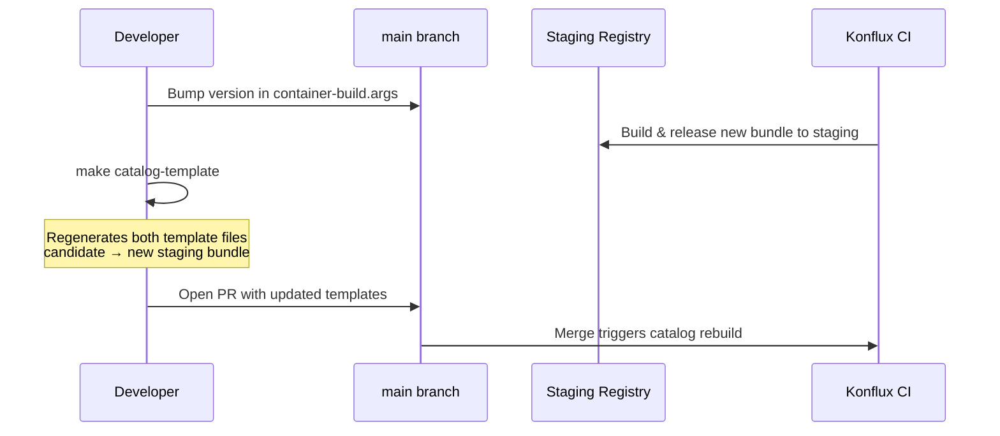
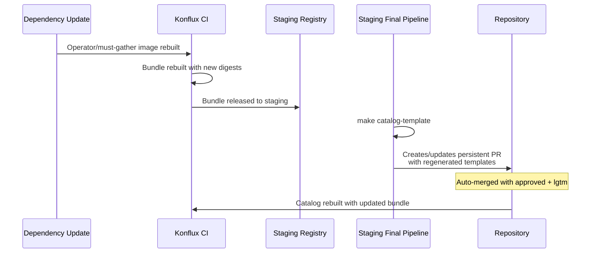
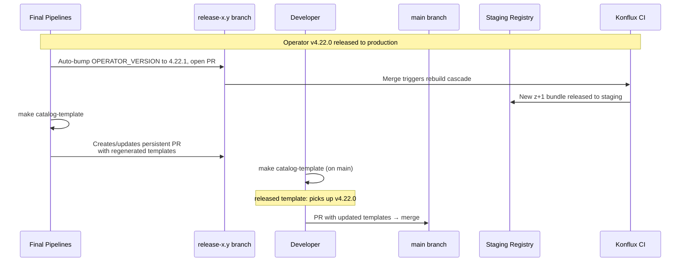
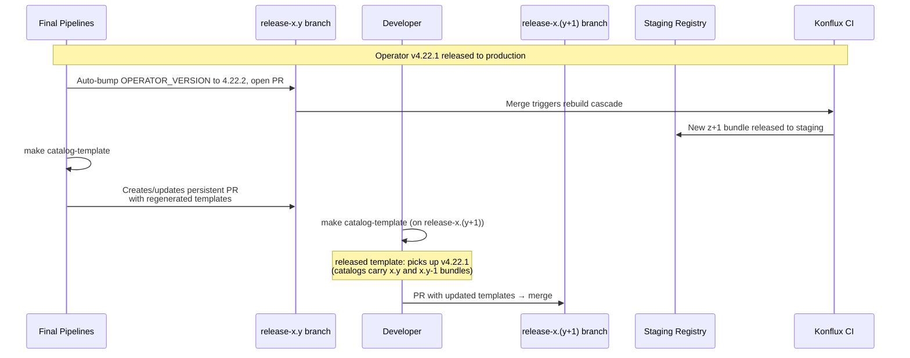

# LVM Operator Catalog

## File Base Catalog

Prior to the introduction of Konflux, the catalog was built and maintained automatically by the build and release systems. When onboarding to Konflux, it was required that the LVM Operator implement and maintain an operator-specific [file-based catalog](https://olm.operatorframework.io/docs/reference/file-based-catalogs/). The resulting catalog would then be built by the catalog pipelines from the Operator repository and integrated automatically into the official OpenShift operator catalog after release.

## FBC Builds and Tooling

### Lifecycle Overview

The catalog templates must be updated in response to several events in the operator's release lifecycle. The scenarios below describe when and how to update them.

#### New Y-Stream Version (after branching main)

After creating a new release branch from `main` (e.g. `release-5.0` → `main` becomes `5.1`), the version is bumped in `release/container-build.args` on `main` and a new bundle is built and released to staging. The catalog templates on `main` need to be regenerated to point at this new candidate bundle.

1. Wait for the new bundle to be released to staging
2. Run `make catalog-template` to regenerate both template files
3. Open a PR to `main` with the updated templates and get it merged



#### New Bundle SHA (no version change)

When the operator or must-gather images are rebuilt (e.g. a dependency update or bug fix) without a version bump, a new bundle is built referencing the updated image digests. After this bundle reaches staging, the staging final pipeline (`catalog-candidate-update-staging-final-pipeline`) automatically runs `make -f release/konflux.make catalog-template` and, if the candidate template changed, creates or updates a persistent PR with the regenerated templates. No manual action is required.



#### After a Y-Stream Production Release

After releasing a new Y-stream operator version to production (e.g. `v4.22.0`), the released bundle moves from the candidate template to the released template. A new z+1 candidate must also be prepared. The release-branch side is automated by the final pipelines; `main` still needs a manual update.

1. On the **release branch**: the production final pipeline (`operator-version-bump-production-final-pipeline`) automatically bumps `OPERATOR_VERSION` in `release/container-build.args` (e.g. `4.22.0` → `4.22.1`) and opens a PR
2. Merging that PR triggers the operator/bundle rebuild cascade; once the new bundle reaches staging, the staging final pipeline (`catalog-candidate-update-staging-final-pipeline`) automatically runs `make catalog-template` and creates or updates a persistent PR with the regenerated templates
3. On **`main`**: run `make catalog-template` to regenerate `lvm-operator-catalog-template.yaml` (the released template picks up the newly released bundle; both files may receive updates)
4. Open a PR to `main` and get it merged



#### After a Z-Stream Production Release

After releasing a z-stream update (e.g. `v4.22.1`), the process is similar to the Y-stream case but the `main` branch update targets the next y-stream's release branch instead. The release-branch side is automated by the final pipelines; the next y-stream release branch still needs a manual update.

1. On the **release branch**: the production final pipeline (`operator-version-bump-production-final-pipeline`) automatically bumps `OPERATOR_VERSION` in `release/container-build.args` (e.g. `4.22.1` → `4.22.2`) and opens a PR
2. Merging that PR triggers the operator/bundle rebuild cascade; once the new bundle reaches staging, the staging final pipeline (`catalog-candidate-update-staging-final-pipeline`) automatically runs `make catalog-template` and creates or updates a persistent PR with the regenerated templates
3. On the **next y-stream release branch**: run `make catalog-template` to regenerate `lvm-operator-catalog-template.yaml` (the released bundle flows into the next version's released template since catalogs carry bundles from x.y and x.y-1)



### Background

When implementing the pipelines for the file based catalog, a few topics came to light:

1. Having the [bundle nudge the catalog](https://konflux-ci.dev/docs/building/component-nudges/) on updates causes every image SHA in the catalog to get overwritten
2. Because of our versioning scheme, utilizing the [OPM semver templates](https://olm.operatorframework.io/docs/reference/catalog-templates/#semver-template) to maintain our catalogs was going to be easier than generating all of the catalog metadata by hand.
3. Automation for regenerating the JSON catalog from the template does not exist in the standard FBC build pipelines

By splitting the semver template into two files, we are able to allow mintmaker to update the bundle reference on a nudge without affecting the other image references in the catalog. To do this, our mintmaker configuration in the `konflux-release-data` repo limits the catalog nudges with the following configuration in the tenant `nudge-renovate-config.yaml`:

```yaml
...
data:
  fileMatch: "..., .*catalog-candidate-template.yaml"
```

This means the files are broken into these templates:

- `release/catalog/lvm-operator-catalog-candidate-template.yaml`
  - only contains a single reference for the **unreleased** bundle reference (ie staging).
- `release/catalog/lvm-operator-catalog-template.yaml`
  - Contains references to all *released bundles matching the LVM Operator support matrix* (ie matching x.y and x.y-1 bundles)

The helper scripts will merge those two files at build time into one cohesive template to be generated and built.

### `.tekton/catalog-patching-build-pipeline.yaml`

The pipeline contains the implementation of a custom build pipeline for the LVM Operator catalogs.
This pipeline extends the basic FBC pipeline with pre- and post-processing steps to merge candidate bundle entries (staging) with released (production) bundle entries and patch the rendered catalog.

**Task execution flow:**

```text
init
└── clone-repository
    └── catalog-template-merge (run-script: prepare-catalog.sh)
        └── run-opm-command (OPM render-template semver)
            └── prefetch-dependencies
                └── run-catalog-patch-script (run-script: render-catalog.sh)
                    └── build-images (matrix: per platform, buildah-remote)
                        └── build-image-index
                            ├── deprecated-base-image-check
                            ├── apply-tags
                            ├── validate-fbc
                            │   └── fbc-target-index-pruning-check
                            └── fbc-fips-check-oci-ta
```

Catalog-specific parameters:

- `opm_args`: `["alpha", "render-template", "semver", "--migrate-level=bundle-object-to-csv-metadata", "release/catalog/lvm-operator-catalog-template.yaml"]`
- `catalog-output-path`: `release/catalog/lvm-operator-catalog.json`
- `catalog-template-merge-script`: `./release/hack/prepare-catalog.sh`
- `catalog-patch-script`: `./release/hack/render-catalog.sh`
- `catalog-patch-image`: pinned `yq` image from `quay.io/konflux-ci/yq`
- `idms_path`: `.tekton/images-mirror-set.yaml` (for pullspec rewriting during OPM render)

The FBC pipeline includes catalog-specific validation (validate-fbc, pruning check against `registry.redhat.io/redhat/redhat-operator-index`, FIPS check) instead of general SAST/vulnerability scans.

### Dockerfile

`release/catalog/catalog.konflux.Dockerfile`

Builds the File-Based Catalog image:

- Base: `registry.redhat.io/openshift4/ose-operator-registry-rhel9:${CATALOG_VERSION}`
- Copies the rendered `lvm-operator-catalog.json` to `/configs/lvms-operator/catalog.json`
- Validates the catalog: `RUN ["/bin/opm", "validate", "/configs/lvms-operator"]`
- Pre-builds the serve cache: `RUN ["/bin/opm", "serve", "/configs", "--cache-dir=/tmp/cache", "--cache-only"]`

### Catalog Scripts

The catalog build involves three scripts that work together:

1. **`release/hack/generate_catalog_template.sh`** (run via `make catalog-template`, either locally or from the staging final pipeline):
   - Lists released bundle tags from `registry.redhat.io` and candidate bundle tags/digests from the private Konflux Quay tenant repo (`quay.io/redhat-user-workloads/.../lvm-operator-bundle`) using `skopeo list-tags`/`skopeo inspect`
   - Resolves digests for each semver-tagged bundle
   - Writes `lvm-operator-catalog-template.yaml` (released bundles from `registry.redhat.io`) and `lvm-operator-catalog-candidate-template.yaml` (candidate entries pinned to the digest resolved from the Quay tenant, referenced under the `registry.stage.redhat.io` staging pullspec)

2. **`release/hack/prepare-catalog.sh`** (runs as pipeline `catalog-template-merge` task):
   - Rewrites staging bundle paths in the candidate template to use the Konflux quay.io paths
   - Merges the candidate template into the released template using `yq`

3. **`release/hack/render-catalog.sh`** (runs as pipeline `run-catalog-patch-script` task, after OPM renders the catalog JSON):
   - Patches channel names: removes `v` prefix (`stable-v5.0` → `stable-5.0`) for legacy compatibility
   - Sets `skipRange` on the latest channel entry for clean upgrade paths
